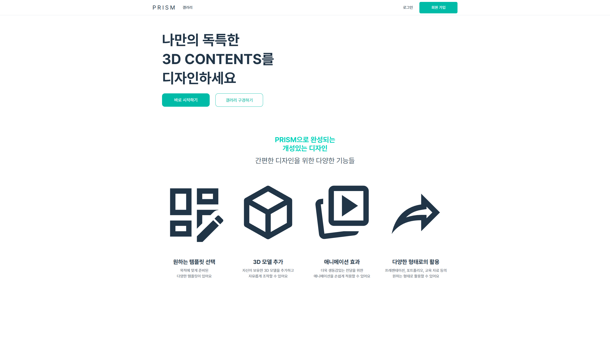
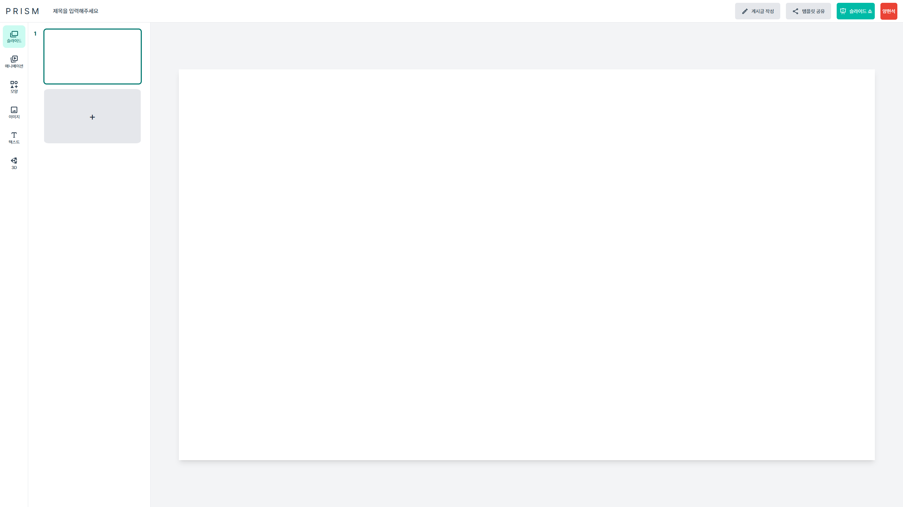
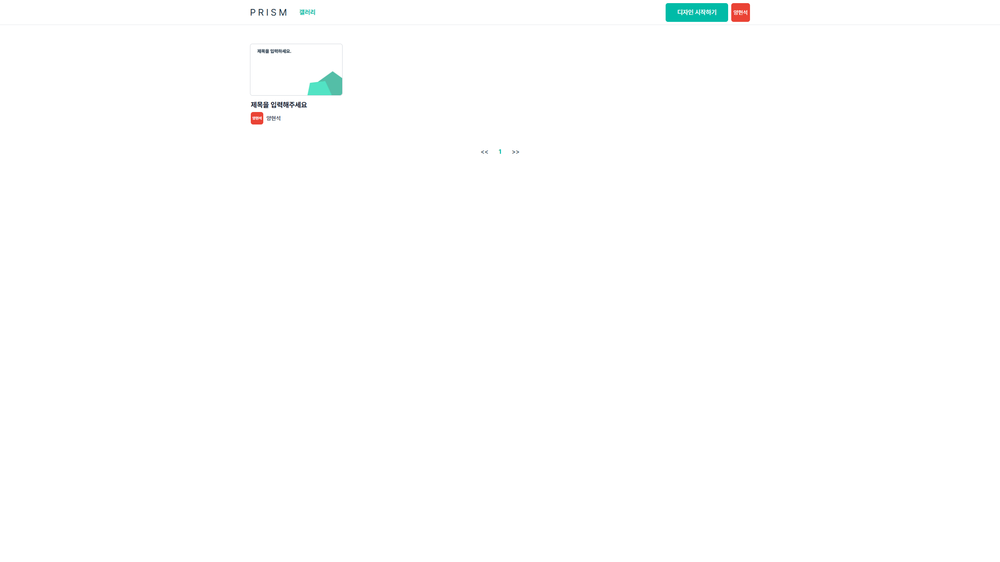
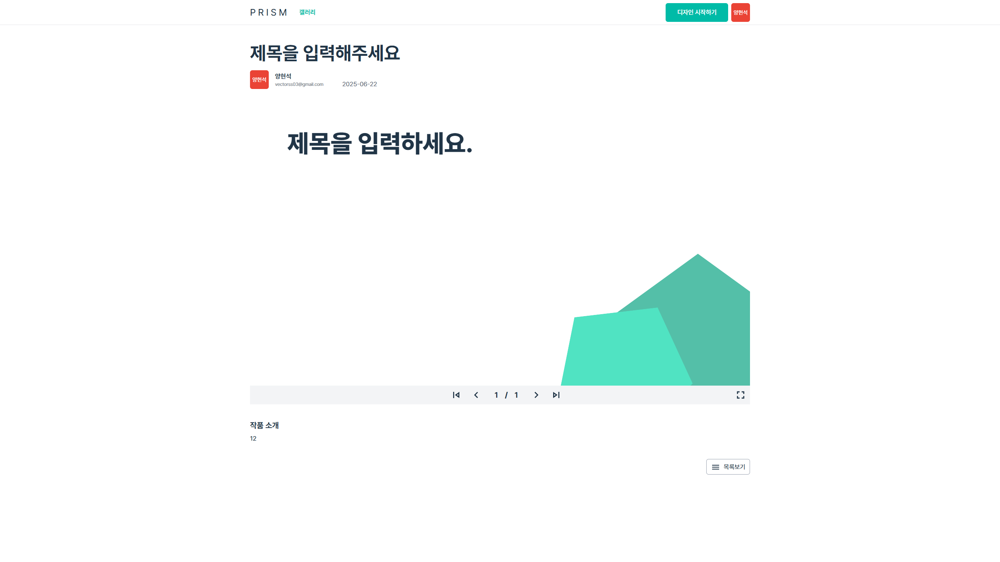

# PRISM Frontend

## 개발환경
- Node.js v22.14.0
- npm v11.2.0
- vue@3.5.13
- vite@6.3.4
- typescript@5.7.3

## 배포환경
- AWS S3
- AWS Cloudfront

## 주요 dependencies
- pinia@3.0.1
- pinia-plugin-persistedstate@4.2.0
- axios@1.8.4
- @vueuse/core@13.1.0
- unocss@66.1.0-beta.8
- unity-webgl@4.3.0
- html-to-image@1.11.13
- vue-slider-component@4.1.0-beta.7
- vuedraggable@4.1.0
- vue-color@3.0.0-alpha.3

자세한 목록은 git clone -> npm list로 확인 가능

## 실행 방법
### 1. 백엔드 서버 실행
[Backend](https://github.com/CAU-Capstone-Design-Project-2025-Team-4/backend) 메뉴얼 참고하여 설치 및 실행

### 2. 저장소 클론
```bash 
git clone https://github.com/CAU-Capstone-Design-Project-2025-Team-4/frontend
```

### 3. 의존성 설치
```
npm install
```

### 4. 실행 및 빌드
#### 4-1. 실행
```
npm run dev
```
http://localhost:5173/ 접속

#### 4-2. 빌드
```
npm run build
```
/dist 디렉토리 확인


## 실행 결과
### 메인

### 에디터

### 갤러리

### 게시글

### 슬라이드 쇼
